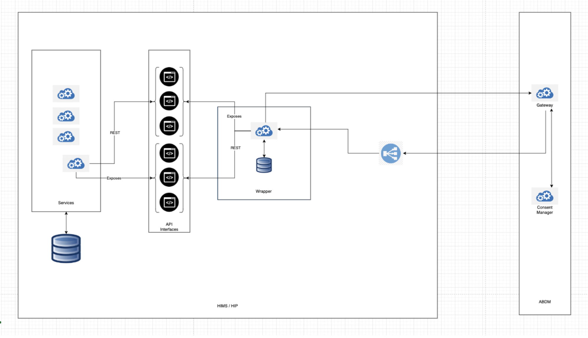

# ABDM Wrapper
The Ayushman Bharat Digital Mission (ABDM) is a government initiative that aims to develop a digital health infrastructure for India. An overview of ABDM can be found [here](https://github.com/NHA-ABDM/ABDM-wrapper/wiki/ABDM-Overview). The ABDM aims to improve the efficiency and transparency of healthcare data transfer between patients, medical institutions, and healthcare service providers. It also allows patients to securely store their medical information and share with others as needed.
The National Health Authority (NHA) is implementing Ayushman Bharat Digital Mission (ABDM) to create a digital health ecosystem for the country. ABDM intends to support different healthcare facilities like clinics, diagnostic centers, hospitals, laboratories and pharmacies in adopting the ABDM ecosystem to make available the benefits of digital health for all the citizens of India.
In order to make any digital solution ABDM compliant, it has to go through 3 milestones and obtain AND certification.
- Milestone 1: ABHA Id creation, verification and obtaining link token
- Milestone 2: Linking and exporting health data
- Milestone 3: Sending a consent request and importing data from other applications in the ecosystem

ABDM Wrapper is created to solve the challenges and issues faced by integrators to bring their systems into ABDM ecosystem.
Wrapper aims to abstract complex workflows and algorithms exposing clean and simple interfaces for integrators.
Wrapper abstracts implementation of HIP and HIU workflows involved in **Milestone 2** and **Milestone 3**.

## Architecture


Wrapper is a springboot application packaged with mongodb database.
Wrapper can be deployed on existing HMIS's / health facility's infrastructure.

There are sets of interfaces which wrapper exposes and the existing services 
need to invoke them to implement ABDM workflows.

At the same time if HMIS is an HIP, then existing services should expose a set 
of interfaces which wrapper needs to invoke to get information from
health providers.

The callback apis which gateway would be making to wrapper should be behind
facility's firewall.

## Pre-requisites
### 1. Install ABHA SBX PHR App on your mobile.

> https://sandbox.abdm.gov.in/docs/phr_app


### 2. Create ABHA Address

```
* Skip if ABHA Address already exists.

ABHA Address can be created using: 
- Mobile Number
- Aadhaar Number
- E-mail

After creating the ABHA Address, your id should look like "yourAbha@sbx"
```

### 3. System Requirements and Installations:
There are two ways to get wrapper and related applications running on your system:
#### 1. Using docker (Preferred): This is an easy way to get wrapper up and running.
Install docker and docker-compose: You can install docker desktop from [here](https://www.docker.com/products/docker-desktop/) to get both.

System Requirements:
- For Mac, check [here](https://docs.docker.com/desktop/install/mac-install/)
- For Windows, check [here](https://docs.docker.com/desktop/install/windows-install/)
- For Linux, check [here](https://docs.docker.com/desktop/install/linux-install/)

Using default docker-compose.yaml, you can bring up wrapper and mongodb services.
Using compose-wrapper-mockgateway.yaml, you can bring up wrapper, mongodb and mock gateway services.

This repository provides two other services:
- Sample HIP
- Sample HIU

If you need to bring these services up, then you need to install gradle from [here](https://gradle.org/install/)

#### 2. If you are facing issues with installing or running docker, then you can install individual components:
- Install mongodb from [here](https://www.mongodb.com/docs/manual/installation/)
- Install jdk 17. Instructions can be found [here](https://www3.cs.stonybrook.edu/~amione/CSE114_Course/materials/resources/InstallingJava17.pdf)
- Install gradle from [here](https://gradle.org/install/)

System Requirements:
- For Mongodb, you can check [here](https://www.mongodb.com/docs/manual/administration/production-notes/) to understand resource requirements.
- For Java17, you can check [here](https://www.oracle.com/java/technologies/javase/products-doc-jdk17certconfig.html) for compatible system configurations.
- Gradle version >= 8.5 should be fine.

Recommended RAM: Systems with more than 8 GB RAM

### 4. Register bridge (hostUrl) with ABDM for callbacks.
1. Get Access Token.
```
curl --location 'https://dev.abdm.gov.in/gateway/v0.5/sessions' \
--header 'Content-Type: application/json' \
--data '{
    "clientId": <client id provided>,
    "clientSecret": <client secret provided>
}'
```
2. Register bridge url
```
curl --location --request PATCH 'https://dev.abdm.gov.in/gateway/v1/bridges' \
--header 'Authorization: Bearer <your accessToken>' \
--header 'Content-Type: application/json' \
--data '{
    "url": <your bridge url>
}'
```
3. Check the BRIDGE URL and Facilities
```
curl --location 'https://dev.abdm.gov.in/gateway/v1/bridges/getServices' \
--header 'Authorization: Bearer your accessToken' \
--header 'X-CM-ID: sbx' \
--data ''
```
## Swagger UI
1. Wrapper API's you can check [here](https://wrapper-sbx.abdm.gov.in/swagger/wrapper)
2. FHIR Module API's you can check [here](https://wrapper-sbx.abdm.gov.in/swagger/fhir)
## Bring the application up.
1. If the actual ABDM Gateway is up and running and responding properly:
   * Provide clientId and clientSecret in [application.properties](src/main/resources/application.properties)
   * If you have installed docker and docker compose then you can bring the application using: `docker-compose up --build`
   * If you have chosen to install separate components, then here is how you can bring the services up:
      - Start mongodb (let the port be defaulted to 27017): Instructions on how to start can be found [here](https://www.mongodb.com/docs/v7.0/administration/install-community/)
  The links like `Install on Linux` do have instructions on how to start the service as well.
      - Go to root of this repository and start wrapper by running `gradle bootrun`

2. In case ABDM sandbox gateway is down or not responding properly, you can use this mock [gateway](https://github.com/NHA-ABDM/ABDM-wrapper/wiki/LightWeight-Gateway) to
   test out your workflows. The ways to bring up the application are:
   * If you have installed docker and docker compose then you can bring the application:
      - Make the following changes to [application.properties](src/main/resources/application.properties):
        <br> Uncomment this line `gatewayBaseUrl=http://gateway:8090` and comment `gatewayBaseUrl=https://dev.abdm.gov.in/gateway`
      - Run `docker-compose -f compose-wrapper-mockgateway.yaml up --build`
   * If you have chosen to install separate components, then here is how you can bring the services up:
     - Start mongodb (let the port be defaulted to 27017): Instructions on how to start can be found [here](https://www.mongodb.com/docs/v7.0/administration/install-community/)
       The links like `Install on Linux` do have instructions on how to start the service as well.
     - Make the following changes to [application.properties](src/main/resources/application.properties):
        <br> Uncomment this line `gatewayBaseUrl=http://gateway:8090` and comment `gatewayBaseUrl=https://dev.abdm.gov.in/gateway`
     - Also, change `gatewayBaseUrl=http://gateway:8090` to `gatewayBaseUrl=http://localhost:8090`
     - Make one more change in mock-gateway's [wrapper.yaml](mock-gateway/src/main/resources/wrapper.yaml):
       <br> change `- url: http://abdm-wrapper:8082` to `- url: http://localhost:8082`
     - Install maven form [here](https://maven.apache.org/install.html)
     - Go to mock-gateway directory: `cd mock-gateway`
     - Run `mvn spring-boot:run`
     - In a different terminal, come to root of the repository and start wrapper by running `gradle bootrun`
3. **Proxy Server Settings**:
   * If wrapper needs to send requests using proxy server then please define the following properties in [application.properties](src/main/resources/application.properties):
      - useProxySettings=true
      - proxyHost=your proxy server ip
      - proxyPort=your proxy server port

## Step-by-Step Testing Instructions:
Testing can be done majorly in 3 parts:
1. Linking of care contexts
   * Discovery and user-initiated linking
   * HIP initiated linking
2. Creation of consents
3. Health information exchange

### Adding patient to wrapper's db
We need to first add patient's details into wrapper's database. There are different ways by which we can do that:
1. Docker container mongosh 
   - If the docker containers are running then you can check the status of containers by running `docekr ps`
   - Then we can get inside the mongo container by running `docker exec -it abdm-wrapper_mongodb_1 bash`
   - Start mongo shell by running `mongosh`
   - Run `use abdm_wrapper`
   - Create a collection named `patients` by running `db.createCollection('patients')`
   - Add an item by providing the values which you want for the patient by running:
     ```
     db.patients.insert({
        "name": "patient's name",
        "gender": "M",
        "dateOfBirth": "DOB in yyyy-mm-dd",
        "patientReference": "patient's reference",
        "patientDisplay": "patient's display name",
        "patientMobile": "patient's mobile number",
        "abhaAddress": "patientAbhaAddress@sbx"
     })
     ```
2. By using Compass for Mongodb
   - Install MongoDB Compass from [here](https://www.mongodb.com/try/download/compass)
   - Launch MongoDB Compass
   - Connect using default settings which is localhost and 27017
   - On GUI, you would see mongosh control on bottom left. You can carry the same steps which are mentioned in Step 1 after mongosh.
   - Alternatively, you can use graphical interface to create a database, a `patients` collection and a patient entry with the folloing values:
      * name
      * gender
      * dateOfBirth
      * patientReference
      * patientDisplay
      * patientMobile
      * abhaAddress
3. By using postman. You can create a request and fire it up to wrapper. The PUT request should look like this:
   ```
    curl --location --request PUT 'localhost:8082/v1/add-patients' \
    --header 'Content-Type: application/json' \
    --data-raw '[{
      "name":"Govada Venu Ajitesh",
      "abhaAddress":"govada2704@sbx",
      "patientReference":"govada2704",
      "gender":"M",
      "dateOfBirth":"YYYY-MM-DD",
      "patientDisplay": "Govada Venu Ajitesh",
      "patientMobile":"Patient mobile"
    }]'
   ```
4. By using [Sample HIP](https://github.com/NHA-ABDM/ABDM-wrapper/wiki/Sample-HIP)
   - Go to [PatientController.java](https://github.com/NHA-ABDM/ABDM-wrapper/blob/master/sample-hip/src/main/java/com/nha/abdm/hip/PatientController.java)
   - Make changes in upsertPatients method for patient details which you want to add or update in wrapper's database (Create a new method in case of a different language)
   - Bring the sample hip application up: `gradle bootRun`
   - Open postman and post a request to `http://localhost:8081/v1/test-wrapper/upsert-patients`

### Register Facility/HIP with ABDM:
- Run the following to get an access token:
     ```
     curl --location 'https://dev.abdm.gov.in/gateway/v0.5/sessions' \
     --header 'Content-Type: application/json' \
     --data '{
         "clientId": <client id provided>,
         "clientSecret": <client secret provided>
     }'
     ```
- Register Facility:
     ```
     curl --location --request PUT 'https://dev.abdm.gov.in/devservice/v1/bridges/addUpdateServices' \
     --header 'Authorization: Bearer <accessToken from previous curl command>' \
     --header 'Content-Type: application/json' \
     --data '[
         {
             "id": "Demo_Ajitesh_HIP",
             "name": "Demo Ajitesh HIP",
             "type": "HIP",
             "active": true,
             "alias": [
                 "Demo_Ajitesh_HIP"
             ]
         }
     ]'
     ```
### Profile Share
Adding of a patient in a particular facility
- When the user scans and shares their profile, the wrapper generates a token and sends to the facility for notifying about the patient
  - So the facility have to implement
  * `POST` Request `/v1/profile/share`
  ```
    {
      "token":"Wrapper generated token number for the user"
      "hipId":"the Facility id"
      "requestId": "499a5a4a-7dda-4f20-9b67-e24589627061",
      "timestamp": "1970-01-01T00:00:00.000Z",
      "intent": {
        "type": "string"
      },
      "location": {
        "latitude": "string",
        "longitude": "string"
      },
      "profile": {
        "hipCode": "12345 (CounterId)",
        "patient": {
          "healthId": "<username>@<suffix>",
          "healthIdNumber": "1111-1111-1111-11",
          "name": "Jane Doe",
          "gender": "M",
          "address": {
            "line": "2nd cross street",
            "district": "Chennai",
            "state": "TamilNadu",
            "pincode": "600301"
          },
          "yearOfBirth": 2000,
          "dayOfBirth": 0,
          "monthOfBirth": 0,
          "identifiers": [
            {
              "type": "MOBILE",
              "value": "9800083232"
            }
          ]
        }
      }
    }
  }
  ```
  - And the facility should respond with SUCCESS or FAILURE as status.
  * Response :
  ```
  {
    "status":"SUCCESS or FAILURE",
    "healthId":"Patient's ABHA number which you get in the request call",
    "tokenNumber":"token generated from wrapper which you get from /v1/profile/share"
  }
  ```
### DeepLinking SMS notify
- When there are records present at facility and the patient doesn't have a abhaAddress, this SMS request will trigger the ABDM to send an SMS to patient.
- That message consists of a link which redirects to install an ABHA app and create a abhaAddress.
- It's up to the patient to link the careContexts, the patient can use user-initiatedLinking to link those existing records. 
    * `POST` Request to `/v1/sms/notify`
    ```
    {
        "requestId": "{{$guid}}",
        "timestamp": "{{$isoTimestamp}}",
        "notification": {
            "phoneNo": "92932245554",
            "hip": {
                "name": "Max Health",
                "id": "Predator_HIP"
           }
        }
    }
   ```
  * Response
  ```
  {
    "clientRequestId": "cfde0a5f-ee14-43ff-96db-998772277435",
    "code": 0,
    "httpStatusCode": "ACCEPTED",
    "message": "DeepLinking request has been accepted by gateway"
  }

  ```
  
### Discovery and User Initiated Linking
Follow the steps to link care contexts:
- When a discover request will land on HIP wrapper, Wrapper will follow this workflow:
  - It will search for patient in its database based on the [logic](https://sandbox.abdm.gov.in/sandbox/v3/new-documentation?doc=DiscoveryAndlink) suggested by ABDM
  - If it finds patient in its database then it will ask HIP for unlinked care contexts
  - If it does not find patient in the database, then it will ask HIP to search for patient using the same [logic](https://sandbox.abdm.gov.in/sandbox/v3/new-documentation?doc=DiscoveryAndlink) which is recommended by ABDM.
  - So, HIP needs to implement following apis and expose endpoints for wrapper:
    - Please note that if HIP has added patients in the wrapper database with adequate details then this api will not be called. But at the same time
      any request for non-existent patient can come to wrapper so in which case HIP will have to implement `/v1/patient-discover`: 
      * `POST` Request:
        ```
        {
          "requestId": "499a5a4a-7dda-4f20-9b67-e24589627061",
          "timestamp": "2024-03-11T07:22:52.213Z",
          "transactionId": "3fa85f64-5717-4562-b3fc-2c963f66afa6",
          "patient": {
            "id": "<patient-id>@<consent-manager-id>",
            "verifiedIdentifiers": [
              {
                "type": "MR",
                "value": "+919800083232"
              }
            ],
            "unverifiedIdentifiers": [
              {
                "type": "MR",
                "value": "+919800083232"
              }
            ],
            "name": "chandler bing",
            "gender": "M",
            "yearOfBirth": 2000
          }
        }
        ```
      * Response:
        ```
        {
          "abhaAddress": <>,
          "name": <>,
          "gender": <>,
          "dateOfBirth": <>,
          "patientReference": <>,
          "patientDisplay": <>,
          "patientMobile": <>,
          "careContexts": [{
            "referenceNumber": <>,
            "display": <>
          }],
        }
        ```
    - Now, in the scenario where wrapper has found patient in its database, it will ask HIP for care contexts. HIP shall
      send all the care contexts for this patient and wrapper will filter out the care contexts which are unlinked and
      send them to gateway as response to discover request. So, HIP should implement `/v1/patients-care-contexts`
      * `GET` Request: `/v1/patients-care-contexts/<patientId>`
      * Response:
        ```
        {
          "abhaAddress": <>,
          "patientRefernce": <>,
          "patientDisplay": <>,
          "careContexts": [{
            "referenceNumber": <>,
            "display": <>
          }],
        }
        ```
    - On PHR App
      * Login into the PHR app using the details which are stored in DB which is your ABHA Address.
      * Search the HIP in PHR app : `Linked Facility` > Click on `(+)` -> Search for the facility (name of the registered facility)
      * Select the facility from searched results and then hit `Fetch Records`.
      * The wrapper responses with a set of careContexts to the PHR
      * Select few / all careContexts and click `Link Records`
        - When the discovery is done and patient wants to link the careContexts, the wrapper will make a request to the facility requesting to send the otp to the patient
          So, HIP should implement `/v1/request/otp`
          * `POST` Request `/v1/request/otp`
          * Request:
          ```
          {
              "abhaAddress":"someone@sbx"
              "patientReference":"patient id at the facility"
          }
          ```
          * Response:
          ```
          {
              "requestId":"",
              "status":"SUCCESS or FAILURE"
              "error":{
                  "code":1000,
                  "message":"If the status if failed or occured any error"
              }
              "linkRefNumber":"Unique id for the otp request"
          }
          ```
        - When the patient enters the otp, the wrapper makes a request to the facility to verify the otp, using the linkRefNumber and token.
        * `POST` Request `/v1/verify/otp`
        * Request:
          ```
            {
                "loginHint":"Discovery OTP request"
                 "requestId":""
                 "authCode":"The OTP"
                 "linkRefNumber":"The same unique id while making a request for OTP"
            }
          ```
        - When the otp gets validated the facility should respond back with
        * Response:
          ```
           {
               "requestId":"",
               "status":"SUCCESS or FAILURE"
               "error":{
                   "code":1000,
                   "message":"If the status if failed or occured any error"
               }
               "linkRefNumber":"Unique id for the otp request"
           }
          ```

    * After confirmation, a message will be displayed  saying **"Successfully Linked"**.

### HIP Initiated Linking
Follow the steps to link care contexts. The linking can be achieved by two modes:
- Auth mode as `DEMOGRAPHICS`. 
   * Again, this can be done in different ways:
      - Using Postman. Fire a POST request to wrapper which looks like the following:
        ```
        curl --location 'localhost:8082/v1/link-carecontexts' \
        --header 'Content-Type: application/json' \
        --data-raw '{
          "requestId": "3773b790-0d5f-4063-a94b-42f07affab86",
          "requesterId":"Predator_HIP",
          "abhaAddress":"ajiteshx@sbx",
          "authMode":"DEMOGRAPHICS",
          "hiTypes": [
             "DiagnosticReport",
             "DischargeSummary",
             "HealthDocumentRecord",
             "ImmunizationRecord",
             "OPConsultation",
             "Prescription",
             "WellnessRecord"
          ],
          "patient": {
            "careContexts": [
              {
                "referenceNumber": "visit-ajitesh-3-29/02/2024",
                "display": "ajitesh OP-3-on 29/02/2024"
              }
            ]
          }
        }'
        ```
     - By using [Sample HIP](https://github.com/NHA-ABDM/ABDM-wrapper/wiki/Sample-HIP)
       - Go to [PatientController.java](https://github.com/NHA-ABDM/ABDM-wrapper/blob/master/sample-hip/src/main/java/com/nha/abdm/hip/PatientController.java)
       - Make changes in linkCareContextsDemographics method for care context details which you want to link
       - Bring the sample hip application up: `gradle bootRun`
       - Open postman and post a request:
          ```
          curl --location 'http://localhost:8081/v1/test-wrapper/link-carecontexts-demographics'
          ```
   * You can check the status of your link request by:
      - If you chose the postman way, you will get a value for `clientRequestId` in your response.
         - Use that clientRequestId's value to fire status request from postman:
            ```
            curl --location 'localhost:8082/v1/link-status/<clientRequestId>'
            ```
      - If you used Sample HIP, then you can fire a request from postman to get link request status:
        ```
        curl --location http://localhost:8081/v1/test-wrapper/link-status
        ```
     - The Response will be
         ```
            {
                 "requestId": "cbf6cd81-88ae-44e8-9ce5-e8c1e5e3b247",
                 "status": "Care Context(s) were linked",
                 "error": null
            }
         ```
- Auth mode as `MOBILE_OTP`.
    * Again, this can be done in different ways:
        - Using Postman. Fire a POST request to wrapper which looks like the following:
          ```
          curl --location 'localhost:8082/v1/link-carecontexts' \
          --header 'Content-Type: application/json' \
          --data-raw '{
            "requestId": "3773b790-0d5f-4063-a94b-42f07affab86",
            "requesterId":"Predator_HIP",
            "abhaAddress":"ajiteshx@sbx",
            "authMode":"MOBILE_OTP",
            "hiTypes": [
                "DiagnosticReport",
                "DischargeSummary",
                "HealthDocumentRecord",
                "ImmunizationRecord",
                "OPConsultation",
                "Prescription",
                "WellnessRecord"
            ],
            "patient": {
              "careContexts": [
                {
                  "referenceNumber": "visit-ajitesh-3-29/02/2024",
                  "display": "ajitesh OP-3-on 29/02/2024"
                }
              ]
            }
          }'
          ```
        - By using [Sample HIP](https://github.com/NHA-ABDM/ABDM-wrapper/wiki/Sample-HIP)
            - Go to [PatientController.java](https://github.com/NHA-ABDM/ABDM-wrapper/blob/master/sample-hip/src/main/java/com/nha/abdm/hip/PatientController.java)
            - Make changes in linkCareContextsMobileOtp method for care context details which you want to link
            - Bring the sample hip application up: `gradle bootRun`
            - Open postman and post a request:
               ```
               curl --location 'http://localhost:8081/v1/test-wrapper/link-carecontexts-mobile-otp'
               ```
    * Verification of otp can be done in following ways:
       - Using Postman. Fire a POST request to wrapper which looks like the following:
          ```
          curl --location 'localhost:8082/v1/verify-otp' \
          --header 'Content-Type: application/json' \
          --data '{
            "loginHint": "hipLinking",
            "requestId":"3fec25a3-5e2a-45c0-ac74-3f16e94d7654",
            "authCode":"570251"
          }'
          ```
      - By using [Sample HIP](https://github.com/NHA-ABDM/ABDM-wrapper/wiki/Sample-HIP)
          - Go to [PatientController.java](https://github.com/NHA-ABDM/ABDM-wrapper/blob/master/sample-hip/src/main/java/com/nha/abdm/hip/PatientController.java)
          - Make changes in verifyOtp method for care context details which you want to link
          - Bring the sample hip application up: `gradle bootRun`
          - Open postman and post a request:
             ```
             curl --location 'http://localhost:8081/v1/test-wrapper/verify-otp'
             ```
    * You can check the status of your link request by:
        - If you chose the postman way, you will get a value for `clientRequestId` in your response.
            - Use that clientRequestId's value to fire status request from postman:
               ```
               curl --location 'localhost:8082/v1/link-status/<clientRequestId>'
               ```
        - If you used Sample HIP, then you can fire a request from postman to get link request status:
          ```
          curl --location http://localhost:8081/v1/test-wrapper/link-status
          ```
        - The Response will be
          ```
             {
                  "requestId": "cbf6cd81-88ae-44e8-9ce5-e8c1e5e3b247",
                  "status": "Care Context(s) were linked",
                  "error": null
             }
          ```

### Consent Creation
- You can post consent request in one of the following ways:
   * Use postman. Fire a request to wrapper which looks like this:
     ```
     curl --location 'localhost:8082/v1/consent-init' \
     --header 'Content-Type: application/json' \
     --data-raw '{
         "requestId": "71abf992-7005-436c-a231-e42e5cd21d19",
         "timestamp": "2024-03-01T21:20:08.701Z",
         "consent": {
             "purpose": {
                 "text": "string",
                 "code": "CAREMGT"
             },
             "patient": {
                 "id": "ajiteshx@sbx"
             },
             "hiu": {
                 "id": "Predator_HIP"
             },
             "requester": {
                 "name": "Dr. Venu AJitesh",
                 "identifier": {
                     "type": "REGNO",
                     "value": "MH1001",
                     "system": "https://www.mciindia.org"
                 }
             },
             "hiTypes": [
                 "OPConsultation"
             ],
             "permission": {
                 "accessMode": "VIEW",
                 "dateRange": {
                     "from": "2023-02-16T11:43:18.548Z",
                     "to": "2024-02-15T11:43:18.548Z"
                 },
                 "dataEraseAt": "2024-10-16T11:43:18.548Z",
                 "frequency": {
                     "unit": "HOUR",
                     "value": 1,
                     "repeats": 0
                 }
             }
         }
     }'
     ```
     **Note: If you are using mock gateway, then you need to provide HIP and care context details as well.**
   * Use [Sample HIU](https://github.com/NHA-ABDM/ABDM-wrapper/wiki/Sample-HIU) 
      - Go to [HIUController.java](https://github.com/NHA-ABDM/ABDM-wrapper/blob/master/sample-hiu/src/main/java/nha/abdm/hiu/HIUController.java) 
      - Make changes to initiateConsent method for consent details or create a similar new method in your controller. 
      - Now bring sample HIU application up by going to `sample-hiu` directory and running `gradle bootrun`. 
      - Open Postman and post a request to http://localhost:8083/v1/test-wrapper/consent-init 
      - Grant this consent using PHR app.
* You can check the status of consent by:
   - If you chose the postman way, you will get a value for `clientRequestId` in your response.
     Use that clientRequestId's value to fire consent status request using postman:
     ```
     curl --location 'localhost:8082/v1/consent-status/<clientRequestId>'
     ```
   - Or, you can use [Sample HIU](https://github.com/NHA-ABDM/ABDM-wrapper/wiki/Sample-HIU). Open postman and post a request:
     ```
     curl --location 'http://localhost:8083/v1/test-wrapper/consent-status`
     ```
* Make sure that consent has been `GRANTED`
    - The response of the /consent-status/<clientRequestId> 
  ```
  {
    "status": "CONSENT_FETCH_ACCEPTED",
    "error": null,
    "httpStatusCode": "OK",
    "initConsentRequest": { //Initiated consent details
        "requestId": "1657430f-8639-419d-bdbc-e6ab361c311a",
        "timestamp": "2024-04-17T17:53:34.441Z",
        "consent": {
            "purpose": {
                "text": "string",
                "code": "CAREMGT",
                "refUri": null
            },
            "patient": {
                "id": "g_ajitesh2001@sbx"
            },
            "hip": null,
            "careContexts": null,
            "hiu": {
                "id": "Demo_Ajitesh_HIP"
            },
            "requester": {
                "name": "Dr. Venu AJitesh",
                "identifier": {
                    "type": "REGNO",
                    "value": "MH1001",
                    "system": "https://www.mciindia.org"
                }
            },
            "hiTypes": [
                "DiagnosticReport",
                "DischargeSummary",
                "HealthDocumentRecord",
                "ImmunizationRecord",
                "OPConsultation",
                "Prescription",
                "WellnessRecord"
            ],
            "permission": {
                "accessMode": "VIEW",
                "dateRange": {
                    "from": "2023-02-16T12:45:18.548Z",
                    "to": "2024-03-15T11:43:18.548Z"
                },
                "dataEraseAt": "2024-04-18T16:25:54.941Z",
                "frequency": {
                    "unit": "HOUR",
                    "value": 1,
                    "repeats": 0
                }
            }
        }
    },
    "consentDetails": { // GRANTED consent details
        "grantedOn": "2024-04-19T15:33:46.146Z", //deniedOn
        "dateRange": {
            "from": "2023-02-16T12:45:18.548Z",
            "to": "2024-03-15T11:43:18.548Z"
        },
        "dataEraseAt": "2024-04-18T16:25:54.941Z",
        "hiTypes": [
            "DiagnosticReport",
            "DischargeSummary",
            "HealthDocumentRecord",
            "ImmunizationRecord",
            "OPConsultation",
            "Prescription",
            "WellnessRecord"
        ],
        "consent": [ // If the consent is EXPIRED it will be in shown in EXPIRED entry.
            {
                "status": "REVOKED",
                "consentArtefacts": [
                    {
                        "id": "b480ac3b-c5a7-4ff4-9cc2-366ae94f2a99",
                        "lastUpdated": "2024-04-17T17:55:09.652Z",
                        "hipId": "Predator_HIP",
                        "careContextReference": [
                            "visit-venu-12/02/2024",
                            "f233b018-c4e8-4ae3-b5f9-33cbbb0a892c",
                            "visit-ajitesh2001 3/04/2024"
                        ]
                    }
                ]
            },
            {
                "status": "GRANTED",
                "consentArtefacts": [
                    {
                        "id": "b3395b53-b44c-4670-a65f-fca2802cedc8",
                        "lastUpdated": "2024-04-17T17:53:51.044Z",
                        "hipId": "Predator_HIP",
                        "careContextReference": [
                            "visit-venu-12/02/2024",
                            "f233b018-c4e8-4ae3-b5f9-33cbbb0a892c",
                            "visit-ajitesh2001 3/04/2024"
                        ]
                    },
                    {
                        "id": "7e1ea746-b25c-4087-b2c3-8fd08ab66c58",
                        "lastUpdated": "2024-04-17T17:53:51.077Z",
                        "hipId": "Predator_HIP",
                        "careContextReference": [
                            "visit-venu-12/02/2024",
                            "f233b018-c4e8-4ae3-b5f9-33cbbb0a892c",
                            "visit-ajitesh2001 3/04/2024"
                        ]
                    },
                    {
                        "id": "ae437aff-bbc0-42fa-8588-2745712b0167",
                        "lastUpdated": "2024-04-17T17:53:51.090Z",
                        "hipId": "NIT-N-Ajitesh",
                        "careContextReference": [
                            "visit-ajitesh2001 1/04/2024"
                        ]
                    }
                ]
            }
        ]
    }
  }
  ```

### Expose Endpoint to share health information bundle
- Integrators need to write an api  which exposes an endpoint `/v1/health-information` to provide health information for a given care context.
- The api should be a `POST` handler and should accept a request body:
   ```
   {
      "hipId":"The Faility ID"
      "careContextsWithPatientReferences": [
        {
            "patientReference":"APOLLO_12334",
            "careContextReference":"OP Visit 20-06-2024"
        }
     ]
   }
   ```
- The api should return a response object:
- If there are multiple HiTypes within a single careContext, add the next hiType FHIR bundle as different entry in the array with same careContextReference.
  ```
  {
     "healthInformationBundle": [
        {
           "careContextReference": "OP Visit 20-06-2024",
           "bundleContent": "Stringified FHIR bundle"
        }
     ]
  }
  ```
- Base url for this endpoint:
   * [application.properties](src/main/resources/application.properties) suggests `hipBaseUrl=http://host.docker.internal:8081`
   * Now, if you are running wrapper as docker and your service is running on the same machine
      - if your service is running on 8081 then above config should work 
      - but if your service is running on a different port then change the config to `hipBaseUrl=http://host.docker.internal:<your service port>` 
   * Lets say you are running wrapper as individual components and your service is running on the same machine
      - if your service is running on 8081 then change the config to `hipBaseUrl=http://localhost:8081`
      - but if your service is running on a different port then change the config to `hipBaseUrl=http://localhost:<your service port>` 
- Path for this endpoint:
  * [application.properties](src/main/resources/application.properties) suggests `getHealthInformationPath=/v1/health-information`
  * But let's say you have created some other path then change the config to `getHealthInformationPath=<your path>`
- Restart wrapper if you have made changes in the config.

### Health Information Exchange  
- You can post health information request in one of the following ways:
   * Use postman. Fire a request to wrapper which looks like this:
      ```
      curl --location 'localhost:8082/v1/health-information/fetch-records' \
      --header 'Content-Type: application/json' \
      --data '{
        "requestId":"b1427c20-74f8-49b9-becd-7c8790b7860f",
        "consentId":"3a7c740e-2fbb-4a8b-8297-30d0bc12c57c"
      }'
      ```
   * Or, use [Sample HIU](https://github.com/NHA-ABDM/ABDM-wrapper/wiki/Sample-HIU)
     - Go to [HIUController.java](https://github.com/NHA-ABDM/ABDM-wrapper/blob/master/sample-hiu/src/main/java/nha/abdm/hiu/HIUController.java)
     - Make changes to healthInformation method to create health information request using the consent id which was granted earlier. You would get this consent id as response of consent-status call.
     - Restart sample-hiu. 
     - Open postman and post a request 
       ```
       curl --location 'http://localhost:8083/v1/test-wrapper/health-information'
       ```
   * Or, use [Reference HIU UI](https://github.com/NHA-ABDM/ABDM-wrapper/blob/master/sample-hiu-ui/sample-hiu.html)
     - Enter patient's abha address in ABHA Address field and hit Enter
     - You will see the granted consents. Hit the first button in Actions column against the consent id to submit its health information.
- You can check the status of health information request by:
   - If you chose the postman way, you will get a value for `clientRequestId` in your response.
     Use that clientRequestId's value to fire health information status request using postman:
     ```
     curl --location 'localhost:8082/v1/health-information/status/<clientRequestId>'
     ```
   - Or, you can use [Sample HIU](https://github.com/NHA-ABDM/ABDM-wrapper/wiki/Sample-HIU). Open postman and post a request:
     ```
     curl --location 'http://localhost:8083/v1/test-wrapper/health-information-status`
     ```
   - Or, use [Reference HIU UI](https://github.com/NHA-ABDM/ABDM-wrapper/blob/master/sample-hiu-ui/sample-hiu.html)
     - You would have search patient using their abha address and listed consents and requested for any consent's health information in above step.
     - Hit the second button in Actions column against the consent id to display health information.
   - The Response of  `/health-information/status/<clientRequestId>`
      ```
      {
         "status": "ENCRYPTED_HEALTH_INFORMATION_RECEIVED",
         "error": null,
         "httpStatusCode": "OK",
         "decryptedHealthInformationEntries": [
            {
                "careContextReference": "visit-venu-1-06/02/2024",
                "bundleContent": "{\"identifier\":{\"system\":\"http://hip.in\",\"value\":\"1ad6c4a6-b049-11ee-9c45-0050568837bb\"},\"entry\":[{\"resource\":{\"date\":\"2024-01-04T15:36:45+05:30\",\"custodian\":{\"reference\":\"Organization/66\",\"display\":\"Demo "}
            }
        ]
     }
     ```
## Helper Applications
This repository offers few helper sample applications: 
- **Sample HIP**
  <br> Check this [page](https://github.com/NHA-ABDM/ABDM-wrapper/wiki/Sample-HIP) for more details on this.

- **Sample HIU**
  <br> Check this [page](https://github.com/NHA-ABDM/ABDM-wrapper/wiki/Sample-HIU) for more details on this.

## Frequently Asked Questions
Check this [page](https://github.com/NHA-ABDM/ABDM-wrapper/wiki/Frequently-Asked-Questions-(FAQs)) to see FAQs.

## Frequently Faced Issues
Check this [page](https://github.com/NHA-ABDM/ABDM-wrapper/wiki/Frequently-Faced-Issues) to see frequently faced issues.

## Developer Guide
Check this [page](https://github.com/NHA-ABDM/ABDM-wrapper/wiki/Developer-guide) to get more details on this.
